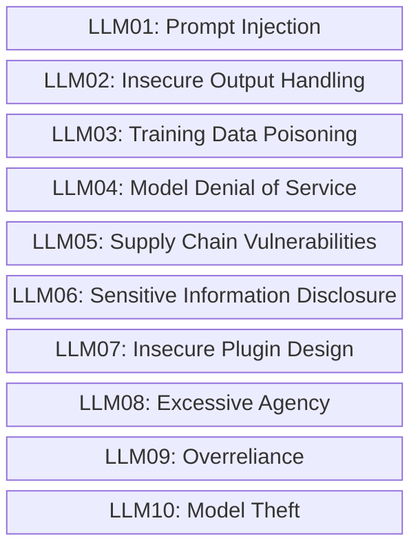

# OWASP-AI
Conteúdos sobre segurança em soluções de Inteligência Artificial, incluindo gráficos, vídeos, exemplos e informações da lista OWASP Top 10 for LLMs and Gen AI Apps.

## OWASP Top 10 for LLMs and Gen AI Apps

Riscos que fazem parte da **OWASP Top 10 for LLMs and Gen AI Apps**:

*ATENÇÃO: Maiores detalhes podem ser encontrados em: https://genai.owasp.org/llm-top-10-2023-24/*
